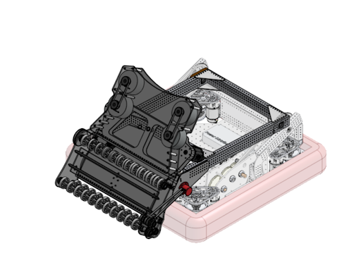

# Arm

## Overview

The Arm refers to the mechanism on the robot that holds [Peter](peter.md) (the shooter) and changes its angle. It includes four motors, two gearboxes, two chain reductions[^1], an absolute encoder, and the two metal arms (to which Peter is attached).

[^1]: A chain reduction refers to two gears, with different sizes, connected by a chain. In the Arm, the final gear of each gearbox is connected to an 18-tooth gear, which is connected to a 42-tooth gear on the main pivot of the arm by a chain.

### Range of Motion

- The arm moves in a range from horizontal (0 degrees) to vertical (around 90 degrees).
- There are different preset angles for the arm to go to, depending on the task.
  - The rest position (default position) is 20 degrees.
  - The intake position is 4 degrees.
  - The amp position (angle for scoring into the Amp) is 78 degrees.
  - The speaker position (angle for scoring into the Speaker) is calculated automatically, and ranges from around 0 to 55 degrees.
- At the start of each round, the arm has to start at a certain angle (around 50 degrees) in order to keep Peter inside the robot starting boundary. The arm is lifted to this position by people before the robot is enabled.

### Design

- The arm is driven by 4 motors, 2 for each side of the arm.
- The 2 motors on each side are meshed to a gearbox, which
