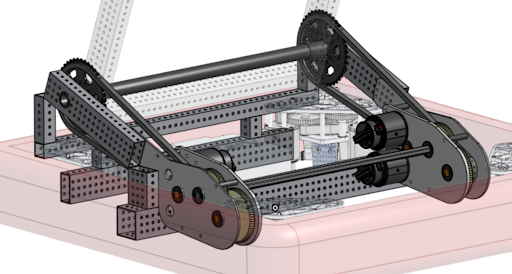

# Arm: Adventures in Angles

## **Overview**

The Arm refers to the mechanism on the robot that holds [Piper](peter.md) (the shooter) and changes its angle. It includes four motors, two gearboxes, two chain reductions, an absolute encoder, and the two metal arms (to which Piper is attached).

### Range of Motion

- The arm moves in a range from horizontal (0 degrees) to vertical (around 90 degrees).
- There are different preset angles for the arm to go to, depending on the task.
  - The rest/default/neutral position is 56.12 degrees.
  - The intake position is 4 degrees.
  - The amp position (angle for scoring into the Amp) is 90 degrees.
  - The speaker position (angle for scoring into the Speaker) is calculated automatically, and ranges from around 0 to 55 degrees.
  - The "Bundt" position is 8.5 degrees.
  - The "Duck" position is 12 degrees.
- At the start of each round, the arm has to start at a certain angle (around 50 degrees) in order to keep Piper inside the robot starting boundary. The arm is lifted to this position by people before the robot is enabled.

### Design

- The arm is driven by 4 motors, 2 for each side of the arm.
- The 2 motors on each side are meshed to a gearbox, which exchanges speed for torque, allowing the motors to lift the heavy arm.
- The gearboxes are connected to the actual arm using two chains, whose gear ratio also exchanges speed for torque.
- On the last gear of one of the gearboxes, there is an absolute encoder. It is used to detect what angle the arm is at when the robot is enabled, and after enabling it is used throughout the match to "reset" the arm motor position, in order to recalibrate the angle and make aiming at the Speaker more accurate and consistent.

## **Programming**

The Arm is moved and controlled by turning the four arm motors. Only one motor (the Top Left motor) is controlled, and the other three motors follow this motor.

The main interface for controlling the Arm is the **ArmSubsystem**, and there is a set of commands that set the Arm's angle to specific values.

### ArmSubsystem.java

The Arm is controlled mainly from `ArmSubsystem.java`. This subsystem has a variable called `targetDegrees`, and on its own, the subsystem constantly moves the motors so that the Arm's angle is at `targetDegrees`. Most methods in this subsystem simply set the value of `targetDegrees` to some constant angle, a given angle, or a calculated angle.

#### *Methods*

The main methods of this subsystem are:

- `public void resetPosition() {...}` - This recalibrates the arm motor encoder's Position by recalculating what it's supposed to be using the data from the Absolute Encoder.
- `public void setTargetDegrees(double angleDegrees) {...}` - This sets the ArmSubsystem's `targetDegrees` variable to `angleDegrees`, clamped between 1 and 90 degrees.
- `public static double calculateAngleToSpeaker(Translation2d robotPosition, boolean redside) {...}` - This uses `robotPosition` to find the robot's distance from the target Speaker on the field, and uses that to calculate the angle the arm needs to be at to score into the Speaker. This angle is then returned to be used in other Commands.
- `public void rotateToRestPosition() {...}` - This sets the `targetDegrees` variable to a constant, so that the arm at around 56 degrees, and is at the right angle to outtake the note in Piper.
- `public double getCorrectedDegrees() {...}` - This calculates and returns the current angle the arm is at, in degrees. Since the motor encoders read an angle of slightly above 0 when the arm is horizontal, this function corrects the reading so that it returns 0 degrees when the arm is horizontal.
- `public boolean atTarget(double tolerance) {...}` - This returns `true` if the Arm's current angle is at `targetDegrees` (plus or minus `tolerance`), and returns `false` otherwise.
- `public void setEnable(boolean toset) {...}` - This sets the `enableArm` variable. When this variable is true, the Arm moves to `targetDegrees` like normal, but when `enableArm` is false, the Arm will not move.

So, `ArmSubsystem.java` is the main interface for controlling the Arm. It allows for the Arm's angle to be set to any arbitrary angle (1 to 90 degrees), and to calculate the Speaker angle. It also allows to check what angle the Arm is at, and whether or not the Arm has reached its `targetDegrees` angle. Finally, it gives the control of either enabling or disabling the Arm.

#### *Initialization*

On initialization, the ArmSubsystem performs a number of steps before it can be used. These steps are:

1. Create a new `CurrentLimitsConfigs` object, with a constant Current Limit, to be applied to the four motors.
2. Create a new `MotorOutputConfigs` object, with Neutral Mode set to Brake, to be applied to the four motors.
3. Create a new `Slot0Configs` object, with a constant **P** value for PID, to be applied to the four motors.
4. Create a new `ArmFeedforward` object, with constant **S**, **G**, and **V** values, to be applied to the four motors.
5. Initialize the four `TalonFX` motor objects, using constants for the device IDs and the CANBus name.
6. Create two `Follower` objects that follow the Top Left motor, with one of the Followers set to opposite direction.
7. Apply the correct Follower objects to the remaining three motors.
8. Apply the MotorOutputConfigs and the CurrentLimits to the four motors.
9. Create a `TalonFX` variable called **master**, and assign it to the Top Left motor.
10. Apply the Slot0Configs to the master motor.
11. Create a new `MotionMagicConfigs` object with constant Cruise Velocity and Acceleration values, and apply it to the master motor.
12. Initialize a new `DutyCycleEncoder` object called **revEncoder**, with a constant Encoder Port, representing the Arm's **Absolute Encoder**.
13. In a new Thread: Wait until revEncoder is connected. Once it is, set the master motor's Encoder reading to revEncoder's position, converted to motor rotations using a constant conversion factor. Then, set the **initialized** variable to true, and initialize the **armHorizontalOffset** variable to the Absolute Horizontal Offset constant, converted to arm rotations using a constant conversion factor.
14. Set the `targetDegrees` variable to the current arm angle, plus 10 degrees. This ensures that once the robot starts, it will lift the arm 10 degrees above the locked ratchet position so that the ratchet disengages.
15. Finally, set the `enableArm` variable to false.

### Arm Commands

There are three commands that control the Arm, and most of them utilize the ArmSubsystem.

Here are the commands that control the arm:

- **ArmToAngleCmd** - This is the main command that provides detailed control of the Arm. The command is given an `angle` Supplier, whose value is used by the command to pass into ArmSubsystem.setTargetDegrees. The command also has many methods that return new ArmToAngleCmd objects with specific angle Suppliers. This is how the command goes about rotating the arm to constant angles, like Amp and Neutral, and also how it uses ArmSubsystem.calculateAngleToSpeaker to rotate the arm to the Speaker position. Finally, the command handles "return states", which is whether the arm should return to rest after it finished moving to the target angle.
- **ResetArm** - This command simply calls ArmSubsystem.resetPosition(), which recalculates the angle reading on the Arm motor using a conversion factor from the Absolute Encoder. This command is called each time before the robot shoots, so that each shot is as accurate as possible.
- **AlterArmValues** - This command allows the "InterMap" to have its offset changed. The driver can use the controller to run this command with parameters +0.25 or -0.25, slightly adjusting the Arm InterMap Offset. Since the InterMap is used by the ArmSubsystem to calculate the angle to aim at the speaker, changing this offset basically manually adjusts the robot's calculated Speaker angle if it happens to be too high or too low on its own.
